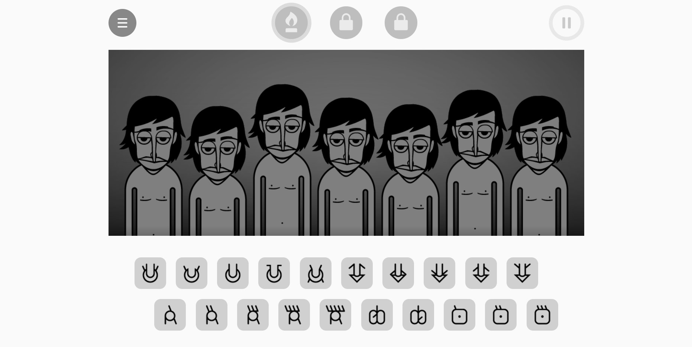

# Incredibox-Clone

Deep clone to incredibox
Check out the original site https://www.incredibox.com.
 
         

 
<a href="https://houssemlachtar.github.io/Incredibox-Clone/">
        Demo
    </a>

## Used Tools

  
Used Libraries

  

1. [JQuery](https://jquery.com).
2. [Analytics](https://segment.com/docs/connections/sources/catalog/libraries/website/javascript/). 
3. [EasePack](https://www.cdnpkg.com/gsap/file/EasePack.js/).
4. [Lame](https://www.npmjs.com/package/lame).
5. [Raf](https://www.npmjs.com/package/raf).
6. [ScrollToPlugin](https://greensock.com/scrolltoplugin/).
7. [SocialSharing](https://www.npmjs.com/package/social-share-js). 
8. [TweenMax](https://greensock.com/docs/v2/TweenMax).
  

  
Softwares

  

1. [Adobe Illustrator](https://www.adobe.com): for sketching the avatars.        

## Only a pc web application  

## Follow me on

[Instagram](https://www.instagram.com/houssem_lachtar/), [Codepen](https://codepen.io/houssem-lachtar), [GitHub](https://github.com/houssemlachtar)
